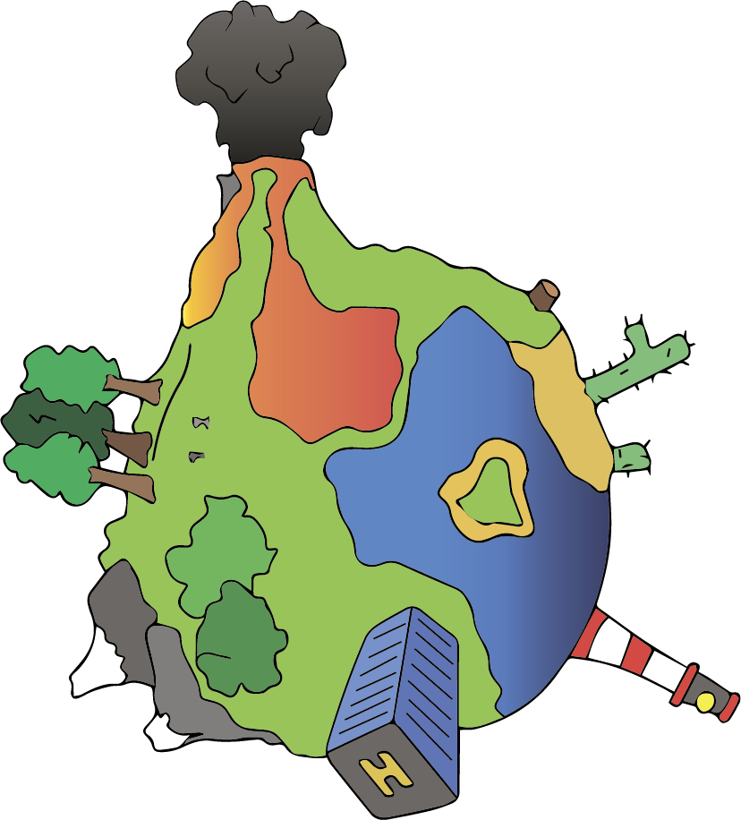

<p align="center">
    
</p>

# Spherix

High performance Minecraft server written in Rust.

> [!NOTE]  
> Currently not stable and under heavy development.

## Features

- Compatible with Minecraft 1.19.4 clients.
- Built with **Tokio**: utilizes a high-performance asynchronous runtime for superior 
stability and responsiveness.
- **Bevy ECS** for Optimized Performance: the server leverages the
[Bevy Entity Component System](https://github.com/bevyengine/bevy/tree/main/crates/bevy_ecs)
(ECS) for optimal performance. This architecture separates game entities (players, blocks,
items) into components and systems, enabling parallel processing and efficient data management.
This leads to improved performance and reduced lag, particularly in scenarios involving a
large number of entities and complex interactions.
- Production-grade worldgen: enjoy the same biomes, structures, and terrain as the official
Minecraft servers, thanks to precise implementation of the world generation.
Our crate `spherix-worldgen` produces worlds (almost) one-to-one the same as the Vanilla server.

## Requirements

- Latest stable Rust compiler
- Vanilla server for data pack generation (one time during setup)

## How to run?

As already mentioned, the server is in an early stage of development and is generally not
user-friendly or intended for use by external parties. You may also encounter some issues during
the process (welcome to the issues!).

However, if you are still eager to try Spherix, you will need to perform a few steps:

1. Clone the source code to your machine:
```shell
git clone https://github.com/d3lph1/spherix && cd spherix
```

2. Using the data generator supplied with the official Minecraft Java Edition server/client,
generate the data packs and place them in the ./generated directory at the root of the
Spherix source code. You should have the following folder and file structure:

```
./generated/assets
./generated/data
./generated/reports
./generated/registry_codec.json
```

This step is necessary because the server relies on information from data packs (such
as block states or world generator settings) for its operation.

3. Build the server in release mode and run it using the following command:

```shell
cargo run --bin spherix-server --profile release --manifest-path ./src/server/Cargo.toml
```

# License

This code is published under the [MIT license](https://opensource.org/licenses/MIT). This means you can do almost anything with it, as long as the copyright notice and the accompanying license file is left intact.
